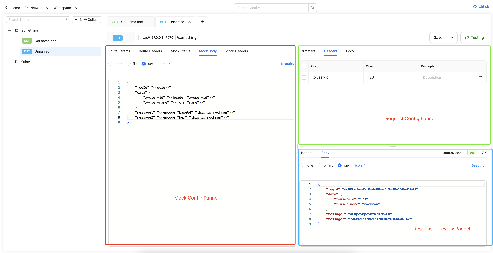

## Mockman

Mockman is suitable for backend developers to temporarily declare API specifications for frontend developers to quickly integrate and debug, especially when reliable services are not fully available.

## Home



## Installation
* windows 
* macos
* linux 

```sh
### client
cd web
npm run build

### server
cd ..
go build .
```

## Quick start
```sh
./mockman_linux -host=:18080
```
* `host`	
server host，access `http://127.0.0.1:18080` in the browser

* `fileset`	
local files directory，when you want mock `application/octet-stream` stream data，epxort local files for quick configuration of web interface

* `dataset`	
data persistence directory，default memory mode

* `workspace`	
optional workspace configuration
when parameters are not set, default configuration will be used

```json
[{"id":"default","name":"DefaultWorkspace","host:":17070","endpiont":"http://127.0.0.1:17070"}]
```
when you want to enable multiple workspaces or overwrite default configuration, you can save the configuration file to a JSON file
```json
[
	{"id":"foo","name":"fooapp","host:":17070","endpiont":"http://127.0.0.1:17070"},
	{"id":"bar","name":"barapp","host:":17071","endpiont":"http://127.0.0.1:17071"}
]
```
you can run 
```sh
./mockman_linux -host=:18080 -workspace=./file.json
```

## Extension methods
Unified use of `golang` template syntax，you can do this  `{{header "xxx"}}`
* `header`
  get value from mock request ，example `{{header "x-user-id"}}`
* `param`
 `http://127.0.0.1:17070/something?id=123`
  get value from mock request ，example `{{param "id"}}`
* `path`
 `http://127.0.0.1:17070/something/:id`
  when you need to access path variables，example `{{path "id"}}`
* `form`
  when request `content-type` is `application/x-www-form-urlencoded`，
  example `{{form "key"}}`
* `json`
  when request `content-type` is `application/json`, thank for [gjson](https://github.com/tidwall/gjson) support，example `{{json "name"}}`
* `rand`
example `{{rand "1","10"}}`
* `uuid`
example `{{uuid}}`
* `encode`
example`{{encode "base64" "this is mockman"}}`
example`{{encode "hex" "this is mockman"}}`

## Example

